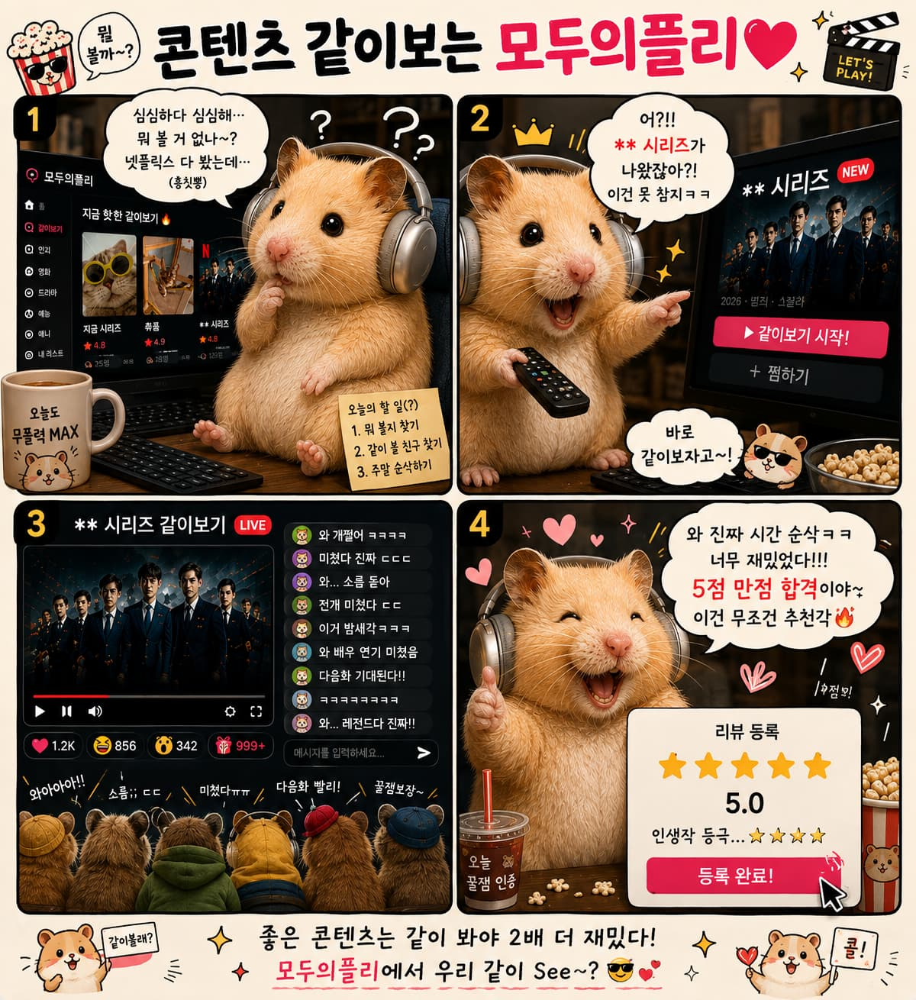
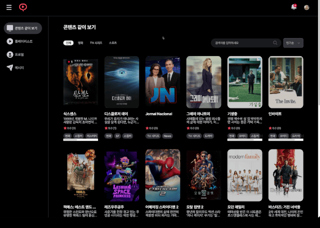
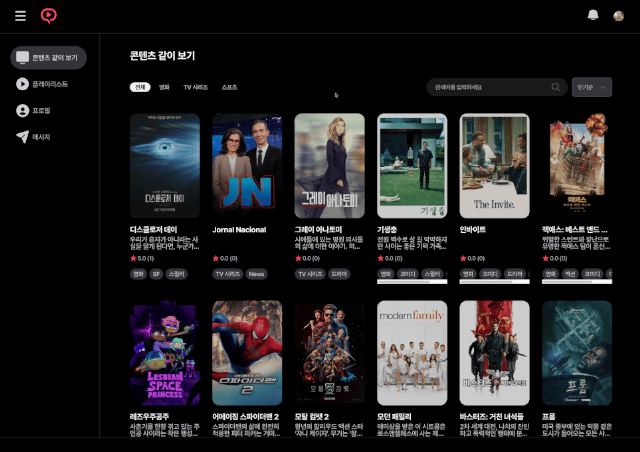
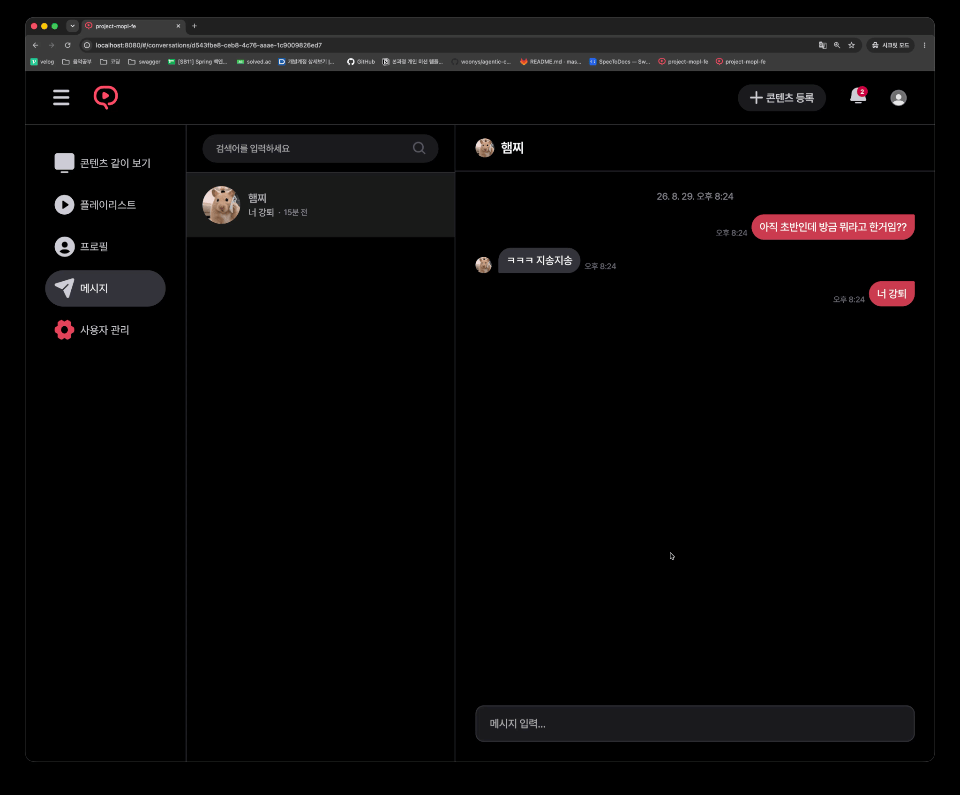
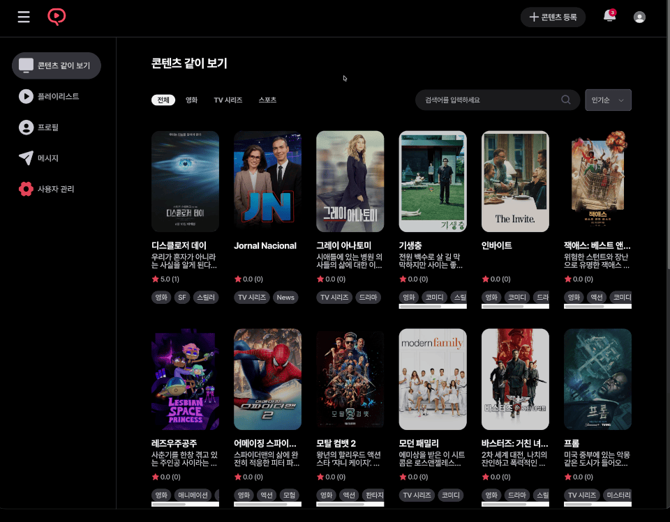
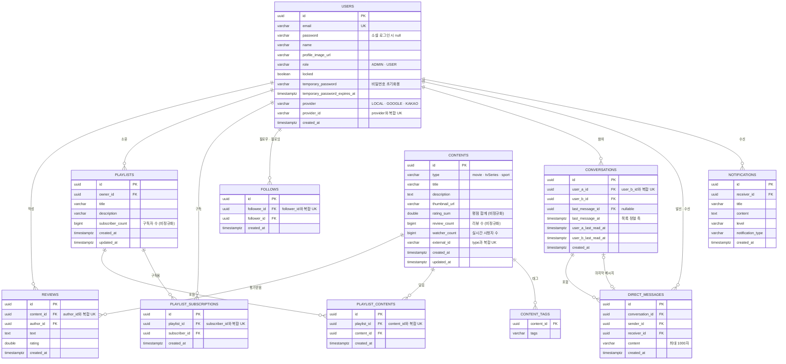

<div align="center">

### 영화 · 드라마 · 스포츠, 함께 보고 함께 기록하다

<table>
<tr>
<td align="center" width="270">
  <br/>
  <b>큐레이팅</b><br/>
  <sub>나만의 플레이리스트로<br/>콘텐츠를 모으고 공유</sub>
</td>
<td align="center" width="270">
  <br/>
  <b>평점 · 리뷰</b><br/>
  <sub>본 것을 기록하고<br/>취향을 나누기</sub>
</td>
<td align="center" width="270">
  <br/>
  <b>같이 보기</b><br/>
  <sub>실시간으로 함께 보고<br/>이야기하기</sub>
</td>
</tr>
</table>

<br/>



<br/><br/>

[프로젝트 소개](#-프로젝트-소개) · [팀원](#-팀원-소개) · [개발 일정](#-개발-일정) · [서비스 화면](#-서비스-화면) · [주요 기능](#-주요-기능)<br/>
[기술 스택](#-기술-스택) · [ERD](#-erd) · [프로젝트 구조](#-프로젝트-구조) · [기술적 도전](#-기술적-도전과-트러블슈팅) · [부하 테스트](#-부하-테스트) · [브랜치 전략](#-브랜치-전략--커밋-컨벤션)

</div>

<br/>

---

## 📌 프로젝트 소개

<table>
<tr><td width="140"><b>프로젝트명</b></td><td>모두의 플리 (Mople)</td></tr>
<tr><td><b>진행 기간</b></td><td>2026.07.27 ~ 2026.08.28 (4.5주)</td></tr>
<tr><td><b>팀 구성</b></td><td>6인 (Backend)</td></tr>
<tr><td><b>저장소</b></td><td><code>dkegldh/sb11-mople-team2</code></td></tr>
<tr><td><b>프로젝트 목표</b></td><td>인증/인가 설계 · 복잡한 DB 설계 · 실시간 통신 구현 · 분산 환경 설계 · 안정성 확보</td></tr>
</table>

<br/>

---

## 👥 팀원 소개

<table>
<tr>
  <td align="center" width="150">
    <a href="https://github.com/dkegldh"><br/><b>김진혁</b></a><br/>
    <sub>@dkegldh</sub>
  </td>
  <td align="center" width="150">
    <a href="https://github.com/jsKim1219"><br/><b>김지성</b></a><br/>
    <sub>@jsKim1219</sub>
  </td>
  <td align="center" width="150">
    <a href="https://github.com/eomoff"><br/><b>엄주혁</b></a><br/>
    <sub>@eomoff</sub>
  </td>
  <td align="center" width="150">
    <a href="https://github.com/DonToong2"><br/><b>김명근</b></a><br/>
    <sub>@DonToong2</sub>
  </td>
  <td align="center" width="150">
    <a href="https://github.com/seongmin0244"><br/><b>강성민</b></a><br/>
    <sub>@seongmin0244</sub>
  </td>
  <td align="center" width="150">
    <a href="https://github.com/vincent865"><br/><b>노정빈</b></a><br/>
    <sub>@vincent865</sub>
  </td>
</tr>
<tr>
  <td align="center"><sub><b>팀장 · Auth &amp; Infra</b><br/>인증·인가<br/>JWT · OAuth2 소셜 로그인<br/>Redis 세션·토큰 관리<br/>ECS Fargate 전환 · CI/CD</sub></td>
  <td align="center"><sub><b>Content &amp; Monitoring</b><br/>콘텐츠 CRUD<br/>시청 세션 · 채팅<br/>SportsDB 배치 · 분산 락<br/>Actuator 메트릭 · S3</sub></td>
  <td align="center"><sub><b>Batch &amp; Resiliency</b><br/>팔로우<br/>TMDB · Spring Batch<br/>Kafka 롤백 · DLT<br/>Redis 분산 락 · 캐시</sub></td>
  <td align="center"><sub><b>Playlist &amp; Kafka</b><br/>리뷰 · 플레이리스트<br/>Kafka 비동기 전환<br/>Elasticsearch 검색<br/>k6 부하 테스트</sub></td>
  <td align="center"><sub><b>Conversation &amp; WebSocket</b><br/>DM 대화방<br/>WebSocket 송수신<br/>Redis Lua 워터마크<br/>비관적 락 최적화</sub></td>
  <td align="center"><sub><b>Admin &amp; Notification</b><br/>어드민 권한 · 계정 잠금<br/>강제 로그아웃<br/>Spring Event · Kafka 알림<br/>Nginx 다중 인스턴스</sub></td>
</tr>
</table>

<br/>

---

## 📅 개발 일정

| 단계 | 기간 | 주요 작업 |
|:---|:---|:---|
| **사전 준비** | `~ 07.26` | ERD·API 명세, 브랜치 전략, 프로젝트 스켈레톤, CI/CD(커버리지 80% 게이트) 세팅 |
| **Phase 1** | `07.27 ~ 07.30` | 핵심 엔티티 설계, 기본 CRUD API 구현 및 테스트 |
| **Phase 2** | `07.30 ~ 08.04` | JWT 인증 필터 적용 및 전 도메인 커서 페이지네이션 구축 |
| **Phase 3** | `08.05 ~ 08.14` | TMDB·SportsDB 수집 파이프라인 연동, WebSocket·SSE 통신 기반 마련, 소셜 로그인 연동 |
| **Phase 4** | `08.15 ~ 08.21` | Kafka 도입(알림·이벤트 비동기화), Redis 분산 락 적용, AWS EC2 배포 및 S3 스토리지 연동 |
| **Phase 5** | `08.22 ~ 08.28` | Elasticsearch 검색 고도화, ECS Fargate 배포 전환, Kafka DLT 고도화 및 부하 테스트 |

<br/>

---

## 🎬 서비스 화면

<table>
<tr>
  <td align="center" width="50%">
    <br/>
    <b>실시간 같이 보기</b><br/>
    <sub>시청자 수 실시간 반영 · 콘텐츠 채팅</sub>
  </td>
  <td align="center" width="50%">
    <br/>
    <b>DM · 실시간 알림</b><br/>
    <sub>WebSocket 즉시 전송 · SSE 알림 수신</sub>
  </td>
</tr>
<tr>
  <td align="center" width="50%">
    <br/>
    <b>어드민 권한 관리</b><br/>
    <sub>권한 변경 · 계정 잠금 시 강제 로그아웃</sub>
  </td>
  <td align="center" width="50%">
    <br/>
    <b>플레이리스트 구독</b><br/>
    <sub>콘텐츠 추가 시 구독자에게 알림</sub>
  </td>
</tr>
</table>

<br/>

---

## ✨ 주요 기능

| 도메인        | 기능 |
|:--------------|:---|
| **인증**      | JWT 로그인·토큰 재발급, Google/Kakao 소셜 로그인, 비밀번호 초기화(메일), 재로그인 시 기존 기기 세션 무효화 |
| **사용자**    | 회원가입, 프로필 수정(S3 이미지), 어드민 권한 변경·계정 잠금 |
| **콘텐츠**    | 콘텐츠 CRUD(어드민), TMDB·SportsDB 수집 배치, Elasticsearch 검색 |
| **평가**      | 평점·의견 CRUD, 콘텐츠 평균 평점·리뷰 수 집계 |
| **큐레이팅**  | 플레이리스트 CRUD, 콘텐츠 추가/삭제, 구독 |
| **소셜**      | 팔로우·팔로우 취소, 팔로우 알림 |
| **같이 보기** | 시청 세션 입장/퇴장 브로드캐스트, 콘텐츠 실시간 채팅 |
| **DM**        | WebSocket 실시간 전송 + SSE 대화 목록 갱신, Redis 읽음 워터마크 |
| **알림**      | 권한 변경·구독·팔로우·DM 이벤트를 SSE로 실시간 전달 |

> 배치 Job은 (TMDB 영화·시리즈), (스포츠) 두 개입니다.

<br/>

---

## 🛠 기술 스택

<div align="center">


</div>

<br/>

| 분류 | 상세 |
|:---|:---|
| **Language & Framework** | Java 17 · Spring Boot 3.5.16 · Spring Security · Spring Batch · Spring Cloud 2025.0.1 |
| **Database & ORM** | PostgreSQL 16 · Spring Data JPA · QueryDSL 5.0.0 · Redis 7 · H2(테스트) |
| **Real-time & Messaging** | WebSocket(STOMP over SockJS) · SSE · Apache Kafka 3.9.0 · Elasticsearch 8.18.8 |
| **Auth & External API** | JWT(jjwt) · OAuth2(Google · Kakao) · TMDB · The Sports DB · OpenFeign |
| **Infra & Deploy** | AWS ECS Fargate · ECR · S3 · Docker · Docker Compose · Nginx · GitHub Actions |
| **Test & Monitoring** | JUnit 5 · Mockito · Testcontainers · JaCoCo · k6 · Actuator · Prometheus · Swagger |

<br/>

---

## 🗂 ERD



---

## 📁 프로젝트 구조

```
com.codeit.mople
├── domain
│   ├── auth              # 로그인·토큰 재발급·비밀번호 초기화·OAuth2
│   ├── user              # 회원가입·프로필·어드민(권한/잠금)
│   ├── content           # 콘텐츠 CRUD + TMDB·SportsDB 수집 배치
│   ├── review            # 평점·의견
│   ├── playlist          # 플레이리스트·콘텐츠 연결·구독
│   ├── follow            # 팔로우
│   ├── conversation      # DM 대화방
│   ├── directmessage     # 다이렉트 메시지
│   ├── notification      # 알림 (이벤트 기반, SSE 전달)
│   └── watchingsession   # 실시간 같이 보기 · 콘텐츠 채팅
├── realtime              # WebSocket 세션 레지스트리 · 강제 종료
└── global                # config · error · event · jwt · sse · storage …
```

각 도메인은 `controller → service → repository` 레이어와
`controller/api`(Swagger 인터페이스) · `dto`(record) · `entity` · `exception` 서브패키지로 구성합니다.

<br/>

---

## 🚀 기술적 도전과 트러블슈팅

| 문제 | 해결 |
|:---|:---|
|  |  |
|  |  |
|  |  |
|  |  |

<br/>

---

## 📈 부하 테스트

<table>
<tr><td width="140"><b>도구</b></td><td>k6</td></tr>
<tr><td><b>환경</b></td><td></td></tr>
<tr><td><b>시나리오</b></td><td></td></tr>
</table>

| 항목 | 개선 전 | 개선 후 |
|:---|:---|:---|
|  |  |  |
|  |  |  |
|  |  |  |

<br/>

---

## 🌿 브랜치 전략 & 커밋 컨벤션

```
main (production)
└── develop (staging)
    └── {type}/{#이슈번호}-{기능명}
        예) feature/#5-user-register, fix/#12-login-bug
```

| 항목 | 규칙 |
|:---|:---|
| **type** | `feature` `fix` `refactor` `docs` `test` `chore` `batch` `deploy` |
| **push** | `develop` · `main` 직접 push 금지 — fork에서 작업 후 upstream `develop`으로 PR |
| **머지** | **2인 이상** 리뷰 승인 후 **Squash and Merge** (PR 제목 = squash 커밋 메시지) |
| **이슈 제목** | `[FEAT] 팔로우 생성 구현` |
| **커밋 메시지** | `feat: 팔로우 생성 구현` · `fix: 중복 구독 방지 버그 수정` |

<br/>

